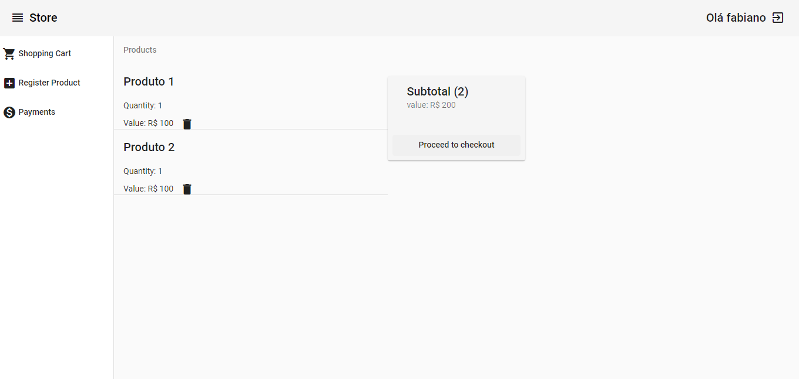
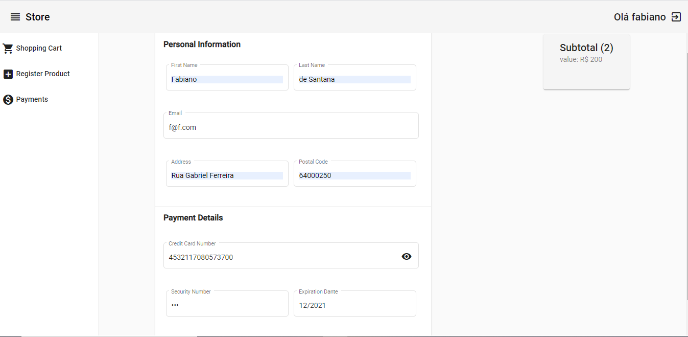

 This project is a frontend app build in order to learn and present some habilities with angular, the backend of the project -> [Backend](https://github.com/fabiomsrs/store_backend).

  

 

  

 

  

 

  

 

  

# StoreFrontend

This project was generated with [Angular CLI](https://github.com/angular/angular-cli) version 10.0.1.

## Development server

Run `ng serve` for a dev server. Navigate to `http://localhost:4200/`. The app will automatically reload if you change any of the source files.

## Further help

To get more help on the Angular CLI use `ng help` or go check out the [Angular CLI README](https://github.com/angular/angular-cli/blob/master/README.md).
